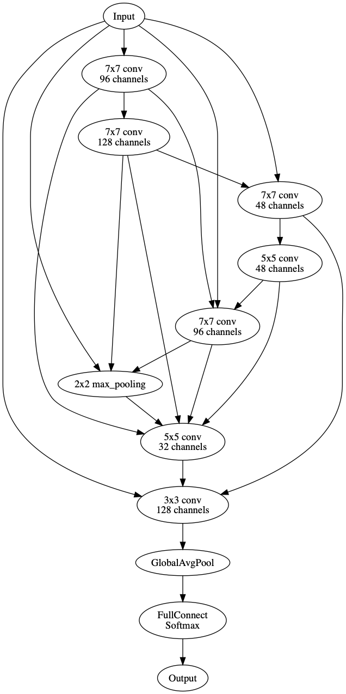

# About the Nerual Architecture Search with Reinforcement Learning Suggestion

The algorithm follows the idea proposed in *Neural Architecture Search with Reinforcement Learning* by Zoph & Le (https://arxiv.org/abs/1611.01578), and the implementation is based on the github of *Efficient Neural Architecture Search via Parameter Sharing* (https://github.com/melodyguan/enas). It uses a recurrent neural network with LSTM cells as controller to generate neural archiecture canddiates. And this controller network is updated by policy gradients. However, it currently does not support parameter sharing. 

## Definition of a Neural Architecture

Define the number of layers is n, the number of possible operations is m.

If n = 12, m = 6, the definition of an architecture will be like:

```
[2]
[0 0]
[1 1 0]
[5 1 0 1]
[1 1 1 0 1]
[5 0 0 1 0 1]
[1 1 1 0 0 1 0]
[2 0 0 0 1 1 0 1]
[0 0 0 1 1 1 1 1 0]
[2 0 1 0 1 1 1 0 0 0]
[3 1 1 1 1 1 1 0 0 1 1]
[0 1 1 1 1 0 0 1 1 1 1 0]
```

There are n rows, the i<sup>th</sup> row has n elements and describes the i<sup>th</sup> layer. Please notice that layer 0 is the input and is not included in this definition.

In each row:
The first integer ranges from 0 to m-1, indicates the operation in this layer.
The next (i-1) integers is either 0 or 1. The k<sup>th</sup> (k>=2) integer indicates whether (k-2)<sup>th</sup> layer has a skip connection with this layer. (There will always be a connection from (k-1)<sup>th</sup> layer to k<sup>th</sup> layer)

## Output of `GetSuggestion()`
The output of `GetSuggestion()` consists of two parts: `architecture` and `nn_config`.

`architecture` is a json string of the deinition of a neural architecture. The format is as stated above. One example is:
```
[[27], [29, 0], [22, 1, 0], [13, 0, 0, 0], [26, 1, 1, 0, 0], [30, 1, 0, 1, 0, 0], [11, 0, 1, 1, 0, 1, 1], [9, 1, 0, 0, 1, 0, 0, 0]]
```

`nn_config` is a json string of the detailed description of what is the num of layers, input size, output size and what each operation index stands for. A nn_config corresponding to the architecuture above can be:
```
{
    "num_layers": 8, 
    "input_size": [32, 32, 3], 
    "output_size": [10], 
    "embedding": {
        "27": {
            "opt_id": 27, 
            "opt_type": "convolution", 
            "opt_params": {
                "filter_size": "7", 
                "num_filter": "96", 
                "stride": "2"
            }
        }, 
        "29": {
            "opt_id": 29, 
            "opt_type": "convolution", 
            "opt_params": {
                "filter_size": "7", 
                "num_filter": "128", 
                "stride": "2"
            }
        }, 
        "22": {
            "opt_id": 22, 
            "opt_type": "convolution", 
            "opt_params": {
                "filter_size": "7", 
                "num_filter": "48", 
                "stride": "1"
            }
        }, 
        "13": {
            "opt_id": 13, 
            "opt_type": "convolution", 
            "opt_params": {
                "filter_size": "5", 
                "num_filter": "48", 
                "stride": "2"
            }
        }, 
        "26": {
            "opt_id": 26, 
            "opt_type": "convolution", 
            "opt_params": {
                "filter_size": "7", 
                "num_filter": "96", 
                "stride": "1"
            }
        }, 
        "30": {
            "opt_id": 30, 
            "opt_type": "reduction", 
            "opt_params": {
                "reduction_type": "max_pooling",
                "pool_size": 2
            }
        }, 
        "11": {
            "opt_id": 11, 
            "opt_type": "convolution", 
            "opt_params": {
                "filter_size": "5", 
                "num_filter": "32", 
                "stride": "2"
            }
        }, 
        "9": {
            "opt_id": 9, 
            "opt_type": "convolution", 
            "opt_params": {
                "filter_size": "3", 
                "num_filter": "128", 
                "stride": "2"
            }
        }
    }
}
```  
This neural architecture can be visualized as


